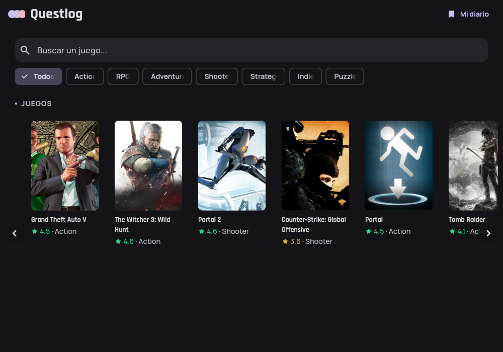
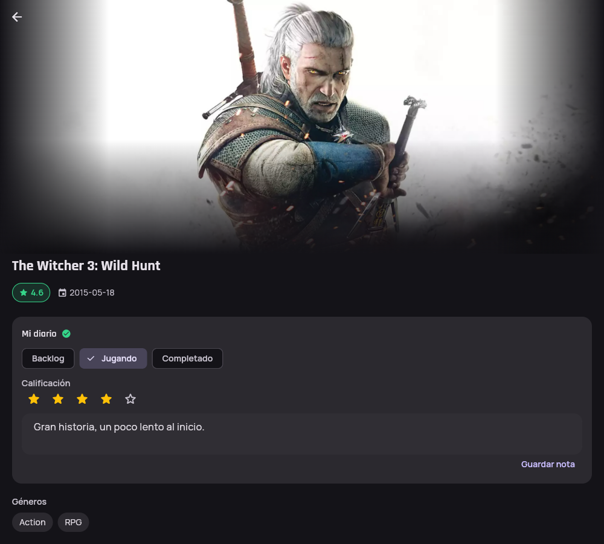

# Questlog

[](https://github.com/aftovar123/questlog/actions/workflows/ci.yml)

Catálogo de videojuegos hecho en Flutter, la idea de fondo 
("Letterboxd para videojuegos") es más grande; esta v1 se
recorta a demostrar Clean Architecture, manejo de estado con Cubit, consumo
real de API con Dio, persistencia local con Hive, y testing en varias capas.

| Catálogo | Detalle + diario |
|---|---|
|  |  |

## Arquitectura

```
lib/
  app/            # composición: router, inyección de dependencias, widget raíz
  core/           # Result/Failure, cliente Dio, interceptor de sesión expirada,
                  # y widgets compartidos entre features
  features/
    games/
      domain/       # Game/Genre (entidades), GamesRepository (contrato), GetGames/GetGameDetail/GetGenres (casos de uso)
      data/         # GameModel/GenreModel, GamesRemoteDataSource (RAWG), GamesRepositoryImpl
      presentation/ # GamesCubit / GameDetailCubit + estados, páginas y widgets
    diary/
      domain/       # PlayStatus, DiaryEntry (entidad), DiaryRepository (contrato), casos de uso
      data/         # DiaryEntryModel, DiaryLocalDataSource (Hive), DiaryRepositoryImpl
      presentation/ # DiaryCubit/DiaryListCubit + estados, DiarySection, la pantalla "Mi diario"
  l10n/           # app_en.arb / app_es.arb + código generado (gen-l10n)
```

Regla de dependencia: `domain` no importa Flutter ni Dio. `data` implementa
las interfaces que `domain` define. `presentation` solo conoce `domain`
(a través de los casos de uso) y a Flutter.

Los errores se modelan como valores: `Result<T>` sellado (`Ok` / `Err`), nunca
excepciones subiendo hasta la UI. El repositorio traduce `DioException` a un
`Failure` de dominio; `GamesCubit` expone estados `Initial/Loading/Empty/Loaded/Failed`.

## Requisitos

- Flutter 3.47.2 (la misma versión fijada en el proyecto real que motivó esto)
- Una API key gratuita de [RAWG](https://rawg.io/apidocs) (20k requests/mes)

## Cómo correrlo

```bash
flutter pub get
flutter run -d chrome --dart-define=RAWG_API_KEY=tu_api_key
```

Sin la key, la app corre igual mostrando el estado de error con botón de
reintentar — es intencional, demuestra el manejo de errores de red.

## Funcionalidad

- Grid de juegos con búsqueda y filtro por género, consumiendo `/games` de
  RAWG. Los chips salen de `/genres` en tiempo real (`GenresCubit`) — no de
  una lista fija a mano — así que reflejan la taxonomía real de RAWG
  (incluye géneros como Casual o Simulation) con los slugs correctos que la
  API espera, en vez de slugs adivinados.
- Búsqueda con debounce: `GamesCubit.searchDebounced` espera 400ms sin
  teclear antes de buscar de verdad, en vez de pedir en cada tecla o exigir
  Enter. Es un problema distinto al de la reentrada protegida: aquella
  descarta una respuesta vieja que ya salió; esta evita que la petición
  salga siquiera mientras el usuario sigue escribiendo.
- Detalle de cada juego: la tarjeta ya trae nombre/imagen/rating/fecha vía
  navegación (para que el Hero transicione sin esperar red), y `GameDetailCubit`
  hace una segunda llamada real a `/games/{id}` que enriquece la pantalla con
  géneros, plataformas y una descripción expandible ("Leer más"). Si esa
  llamada falla, la pantalla se degrada con gracia a los datos que ya tenía.
- Imágenes con fade-in al cargar (`FadingNetworkImage`) en vez de aparecer de
  golpe, y placeholder consistente si la URL falla.
- Scroll infinito en el carrusel: al acercarse al final pide la siguiente
  página y la agrega a la lista (`GamesCubit.loadMore`), sabiendo si hay más
  por `GamesPage.hasMore` (calculado en el repositorio, no adivinado por la UI).
- Reentrada protegida: cada `loadGames`/`loadMore` lleva un número de secuencia
  interno en el Cubit — si el usuario busca o cambia de filtro varias veces
  seguidas, una respuesta vieja que llega tarde ya no puede pisar el estado de
  una más reciente. Es el patrón "restartable" hecho a mano, sin necesitar Bloc.
- Diario personal (v2): en el detalle de cada juego se puede marcar
  Backlog/Jugando/Completado, calificar de 1 a 5 estrellas y escribir una
  nota, persistido localmente con Hive (no `sqflite`, para que también
  funcione en Flutter Web vía IndexedDB). `DiaryCubit` espera su propia carga
  inicial (`_ready`) antes de aplicar cualquier actualización, para que una
  interacción muy rápida justo al abrir la pantalla no se pierda en silencio.
  Calificación y nota se guardan juntas con una sola acción explícita
  ("Guardar reseña") en vez de guardar (y confirmar) cada toque de estrella
  por separado; una vez guardada, la reseña se muestra en modo lectura con
  un color distinto y un botón "Editar" que vuelve a habilitar la edición.
- Pantalla "Mi diario" (ícono de marcador en el app bar): lista todo lo que
  marcaste, más reciente primero. `DiaryListCubit` compone dos features sin
  acoplar sus dominios — lee las entradas de `diary` y les pega los datos de
  cada juego pidiéndolos a `games` en paralelo (`Future.wait`); si la
  enriquecida de un juego puntual falla, esa fila se degrada a un dato
  genérico en vez de desaparecer de la lista. Cada fila se puede deslizar
  para eliminarla (con confirmación antes de borrar), cerrando el CRUD del
  diario — `DeleteDiaryEntry` existía en el dominio desde el inicio, pero
  hasta ahora nada lo usaba.
- Interceptor de sesión expirada: `SessionAwareErrorInterceptor` detecta un
  401 en `onError` y solo notifica (`SessionExpiredNotifier`) — nunca navega
  ni toca la UI directamente. `QuestlogApp` escucha esa notificación y decide
  qué hacer (mostrar un mensaje), separando "detectar" de "decidir". RAWG no
  tiene sesión real, así que esto solo dispara con una API key inválida —
  pero está conectado exactamente como lo estaría en una API con sesión de
  verdad.

## Tests

```bash
flutter test
flutter analyze
```

Ambos corren automáticamente en CI ([GitHub Actions](.github/workflows/ci.yml))
en cada push y pull request a `main` — sin secretos ni API key: ningún test
llama a RAWG de verdad, todos mockean la capa de repositorio.

76 tests en 5 capas: 5 de `core/network` (`SessionExpiredNotifier` y
`SessionAwareErrorInterceptor` — que detecta un 401 con un `DioException`
construido a mano, sin depender de una llamada de red real ni de un
navegador, que puede ocultar el código de estado real por CORS), 8 de
casos de uso de `games` (`GetGames`, `GetGameDetail`, `GetGenres`,
repositorio mockeado con mocktail), 13 de `GamesCubit`/`GameDetailCubit` (con
`bloc_test` y tests unitarios directos, cubriendo éxito/vacío/error/degradación/
paginación/reentrada, y el debounce de `searchDebounced` — incluyendo que
varias llamadas rápidas colapsan en una sola búsqueda con el último valor,
y que un `loadGames` inmediato cancela un debounce pendiente), 2 de
`GenresCubit` (incluyendo que un fallo se
degrada a una lista vacía, no a un estado de error), 5 de parseo de
`GameModel`/`GenreModel.fromJson`, 28 de `diary`
(casos de uso y `DiaryCubit`/`DiaryListCubit` mockeados con mocktail/bloc_test
— incluyendo que `saveReview` guarda calificación y nota juntas en un solo
guardado, que una entrada cuya enriquecida de juego falla se degrada en vez
de romper la lista, que `DiaryListCubit.load()` descarta una respuesta
vieja que llega tarde (mismo patrón "restartable" que `GamesCubit`), y que
`delete()` quita solo la entrada correcta o deja la lista intacta si falla
—, más el repositorio contra una instancia real de Hive vía
`hive_test` — ahí sí importa probar la persistencia en sí, no un mock de
ella), y 15 de widgets con `testWidgets`: `GameCarousel` (renderizado,
paginación al hacer scroll) y `DiarySection` (estados de carga/guardado/error,
que tocar una estrella solo actualiza el borrador sin guardar, que tocar
"Editar" o una estrella en modo lectura vuelve a modo edición, que "Guardar
reseña" guarda calificación y nota juntas, y que el snackbar de confirmación
aparece solo cuando el guardado termina sin error — mockeado con
`MockCubit`/`whenListen` de `bloc_test`).

## Qué falta

- `hasMore` se calcula comparando el tamaño de la página contra `page_size`
  (RAWG no da un flag barato para esto) — si una página llega exactamente
  llena pero es la última, se hace una petición extra que vuelve vacía. Es una
  simplificación consciente, no un descuido.
