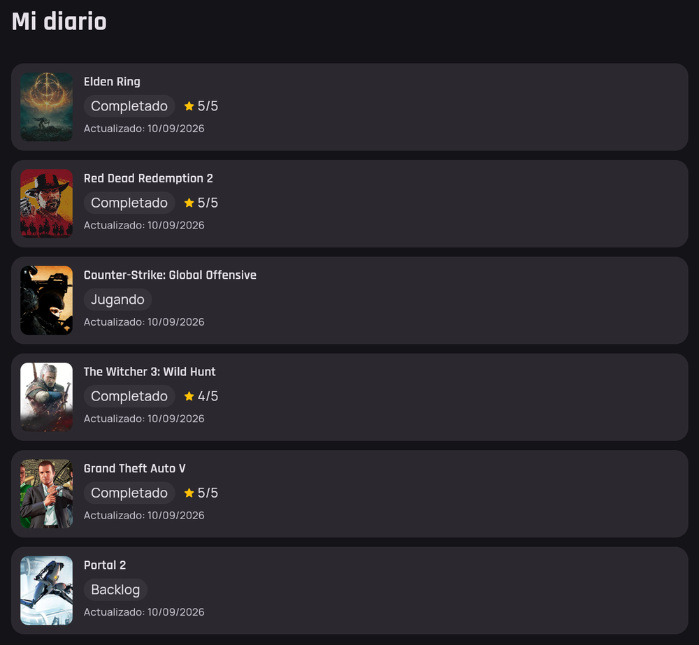
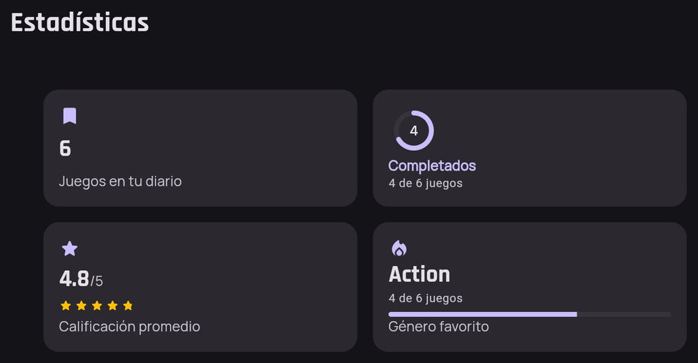
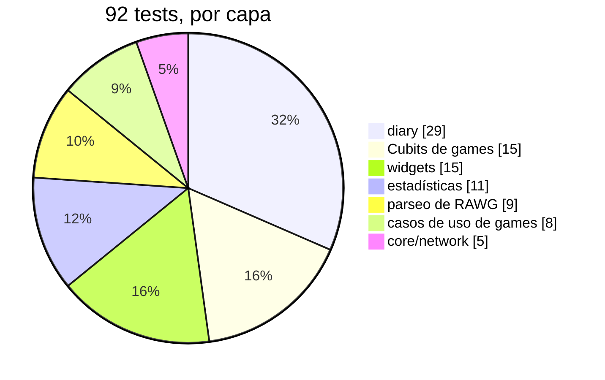

# Questlog

[](https://github.com/aftovar123/questlog/actions/workflows/ci.yml)

Catálogo de videojuegos hecho en Flutter, la idea de fondo 
("Letterboxd para videojuegos") es más grande; esta v1 se
recorta a demostrar Clean Architecture, manejo de estado con Cubit, consumo
real de API con Dio, persistencia local con Hive, y testing en varias capas.

| Catálogo | Detalle + diario |
|---|---|
|  |  |

| Mi diario (6 juegos reales) | Estadísticas |
|---|---|
|  |  |

## Arquitectura

```
lib/
  app/            # composición: router, inyección de dependencias, widget raíz
  core/           # Result/Failure, cliente Dio, interceptor de sesión expirada,
                  # y widgets compartidos entre features
  features/
    games/
      domain/       # Game/Genre (entidades), GamesRepository (contrato), GetGames/GetGameDetail/GetGenres (casos de uso)
      data/         # GameModel/GenreModel, GamesRemoteDataSource (RAWG), GamesRepositoryImpl
      presentation/ # GamesCubit / GameDetailCubit + estados, páginas y widgets
    diary/
      domain/       # PlayStatus, DiaryEntry (entidad), DiaryRepository (contrato), casos de uso
      data/         # DiaryEntryModel, DiaryLocalDataSource (Hive), DiaryRepositoryImpl
      presentation/ # DiaryCubit/DiaryListCubit + estados, DiarySection, la pantalla "Mi diario"
  l10n/           # app_en.arb / app_es.arb + código generado (gen-l10n)
```

Regla de dependencia: `domain` no importa Flutter ni Dio. `data` implementa
las interfaces que `domain` define. `presentation` solo conoce `domain`
(a través de los casos de uso) y a Flutter.

Los errores se modelan como valores: `Result<T>` sellado (`Ok` / `Err`), nunca
excepciones subiendo hasta la UI. El repositorio traduce `DioException` a un
`Failure` de dominio; `GamesCubit` expone estados `Initial/Loading/Empty/Loaded/Failed`.

## Requisitos

- Flutter 3.47.2 (la misma versión fijada en el proyecto real que motivó esto)
- Una API key gratuita de [RAWG](https://rawg.io/apidocs) (20k requests/mes)

## Cómo correrlo

```bash
flutter pub get
flutter run -d chrome --dart-define=RAWG_API_KEY=tu_api_key
```

Sin la key, la app corre igual mostrando el estado de error con botón de
reintentar — es intencional, demuestra el manejo de errores de red.

## Funcionalidad

- **Catálogo**: grid de juegos con búsqueda y filtro por género, consumiendo
  `/games` y `/genres` de RAWG en tiempo real — los chips reflejan la
  taxonomía real de la API, no una lista fija a mano.
- **Búsqueda con debounce**: `searchDebounced` espera 400ms sin teclear antes
  de buscar, en vez de pedir en cada tecla.
- **Detalle enriquecido**: la tarjeta transiciona al instante (`Hero`) con los
  datos que ya trajo la navegación; una segunda llamada a `/games/{id}` la
  completa con géneros, plataformas y descripción, degradándose con gracia si
  esa llamada falla.
- **Scroll infinito**: pagina con el campo `next` real que devuelve RAWG, no
  adivinando si una página llegó llena.
- **Reentrada protegida**: un número de secuencia interno en el Cubit
  descarta respuestas viejas que llegan tarde — el patrón "restartable" hecho
  a mano, sin necesitar Bloc.
- **Diario personal**: estado (Backlog/Jugando/Completado), calificación de 1
  a 5 y nota, persistidos con Hive (no `sqflite`, para que también funcione en
  Flutter Web vía IndexedDB). Calificación y nota se guardan juntas con una
  sola acción explícita ("Guardar reseña").
- **Mi diario**: lista todo lo marcado, más reciente primero, componiendo
  `diary` y `games` sin acoplar sus dominios. CRUD completo — deslizar para
  eliminar una entrada, con confirmación.
- **Estadísticas**: 4 métricas calculadas en vivo desde lo que hay guardado en
  Hive — juegos en el diario, completados, calificación promedio y género
  favorito — vía `computeDiaryStats`, una función pura sin repositorio ni
  async.
- **Sesión expirada**: `SessionAwareErrorInterceptor` detecta un 401 y solo
  notifica; la capa de presentación decide qué hacer — separa "detectar" de
  "decidir".

## Tests

```bash
flutter test
flutter analyze
```

Corren solos en CI ([GitHub Actions](.github/workflows/ci.yml)) en cada push
y pull request a `main` — sin secretos ni API key: ningún test llama a RAWG
de verdad, todos mockean la capa de repositorio.



Lo que vale la pena señalar:

- El repositorio del diario se prueba contra una instancia real de Hive
  (`hive_test`), no un mock — ahí sí importa probar la persistencia en sí.
- Reentrada protegida en `GamesCubit`/`DiaryListCubit`: una respuesta vieja
  que llega tarde no puede pisar el estado de una más reciente.
- Debounce de búsqueda: varias teclas rápidas seguidas colapsan en una sola
  petición real, con el último valor.
- `updatedAt` se sella con lo que lee un `Clock` inyectado, no con
  `DateTime.now()` directo — así un test lo fija a un instante exacto en vez
  de asumir el momento justo en que corrió.
